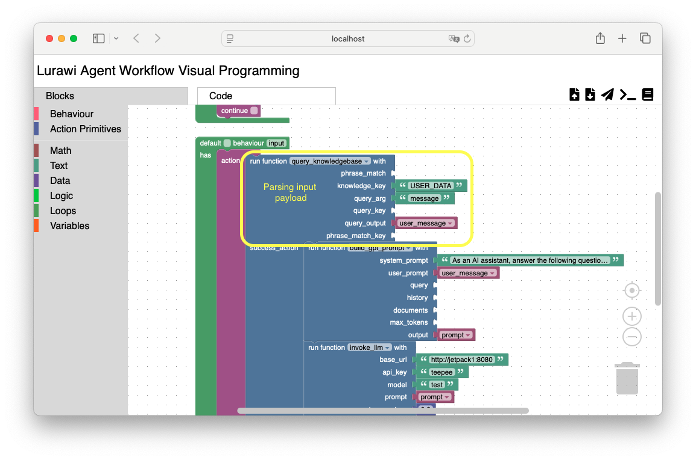

# Lurawi - a Agent Workflow Orchestration Engine

# Introduction
Lurawi is a NoCode/LowCode development environment for building agent based workflow. A ML/GenAI engineer can design, experiment and implement a workflow interactively with minimum effort. The end result is a XML/JSON based data file that can be deployed and executed on the Lurawi runtime engine within a container image. The container image can be deployed in a Cloud environment such as AWS.

# Key Features
* Visual design of workflows. A workflow can be composed visually via drag-n-drop Blocks onto a canvas.
* Minimum coding. Workflows are constructed visually and no need to program in code.
* Modular and extensible design. Functionalities are captured in modularised custom function classes. Additional Custom functions can be introduced to extend the overall system capabilities. 
* A unified REST API specification out of box. See [API Specifications](./docs/APISpecifications.md).
* Readily deployment as a Docker container in AWS.
* Integration with Group API gateway for client authentication and access.
* Lurawi-in-a-box: A docker image that contains a live lurawi system that can be executed on a local computer system that has Docker Desktop installed.

The following sections will give a detailed instructions on how to experiment with Lurawi using pre-built Lurawi docker image.

# Installation
NOTE: Check out advanced [Lurawi setup as VS Code Dev Container](./docs/LurawiDevContainer.md).

## Prerequisites
We assume that you have a modern workstation/machine that supports virtualisation and has
* Docker Desktop installed

Simply do
```bash
docker pull kunle12/lurawi:latest
```

At the end of download, you should have the following docker image in your Docker Desktop
<figure>
    
    <figcaption>Fig. 1 Downloaded Lurawi docker image under Docker Desktop.</figcaption>
</figure>


# Launch Lurawi docker
Click the Play button under Actions
<figure>
    
    <figcaption>Fig. 2 Launch Lurawi Docker container: bind port 3031 and 8081 to local machine.</figcaption>
</figure>

You need to bind your local machine port 3031 and 8081 to the container, set ```PROJECT_NAME``` and ```PROJECT_ACCESS_KEY``` to your registered project name and access key respectively.

You should have container logs shown in the Docker Desktop similar to the following after the launch
<figure>
    
    <figcaption>Fig. 3 Launch of Lurawi Docker container.</figcaption>
</figure>

# Work with Lurawi agent workflow visual editor
Open a tab in your favourite browser to http://localhost:3031, you will have Lurawi Agent workflow visual editor opened:
<figure>
    
    <figcaption>Fig. 4 Lurawi agent workflow visual editor</figcaption>
</figure>

Download this [lurawi_example.xml](./lurawi_example.xml), click 
 button to load this file and you will have the following. Update the model name (red circled) to a model that has been assigned to your project.
<figure>
    
    <figcaption>Fig. 5 Loaded example workflow.</figcaption>
</figure>

Click 
button to dispatch the current workflow to the test lurawi runtime server running in the docker container to start testing the workflow:
<figure>
    
    <figcaption>Fig. 6 Successfully uploaded the workflow to the Lurawi runtime engine.</figcaption>
</figure>

You can click **Code** tab (Fig. 7) to view the JSON based code dynamically generated from the visual blocks shown in the **Blocks** tab (consider visual blocks are the source code; JSON code is the compiled code for execution) Note, if the visual block program contains errors, **Code** tab will display errors instead of valid JSON code. In such scenarios, switch to **Blocks** tab to fix the code and back to **Code** for validation.
<figure>
    
    <figcaption>Fig. 7 Code tab (circled in red) shows the JSON code generated from the visual program blocks.</figcaption>
</figure>

# Test Workflow
Click  button to open a new tab to a Lurawi test console (Fig. 8) and start typing your question/message

<figure>
    
    <figcaption>Fig. 8 Lurawi Test Console.</figcaption>
</figure>

NOTE: This test console works only for the following input payload specification:

```json
{
  "uid": "client/user id",
  "name": "client name",
  "session_id": "optional client provided session id",
  "data" : {
    "message": "a text prompt message",
  }
}
```

Yellow box in Fig. 5 parses dictionary payload under data key. If you change the data payload structure in your workflow, the test console may no longer work. Use CURL command or other REST API test tool to call the endpoint at ```http://localhost:8081/projects/{your_project_name}/message```.

# Saving Workflow
Click  button to download the finalised workflow from the visual editor. There are two files to download from **Blocks** tab and **Code** tab respectively: xml file from **Blocks** tab contains the visual block code, whereas JSON program code from **Code** tab is used in Lurawi for execution.

<figure>
    
    <figcaption>Fig. 9 Saving visual block code in Blocks tab.</figcaption>
</figure>
 
Both files should be saved in a GitHub repo. With a properly configured git action a custom docker image can be built and deployed in production.

# Next Steps

Lurawi agent workflow visual editor is based off [Google Blockly](https://developers.google.com/blockly) visual programming editor. It is strongly recommended to get familiarisation with block-based coding mechanics from the tutorials provided by [Scratch](https://scratch.mit.edu/), especially if you do not have prior programming experiences.

Once you are familiar with block based programming, read [Lurawi specific block concepts](./docs/LurawiConcepts.md) and [Lurawi prebuilt custom blocks](./docs/LurawiGenAiCustoms.md) will give you detailed descriptions of prebuit Lurawi custom function blocks. See [Advanced: RAG Reference Implementation in Lurawi](./docs/RAGReferenceImplementation.md) for a concrete example.

Lurawi uses a plug-in mechanism to extend its capabilities and integrate with any third party systems. Check out [Advanced: How to Create Lurawi Custom Action Primitives](./docs/LurawiGenAiCustoms.md).

To conclude, checkout [Advanced: End-to-end Lurawi Development](./docs/LurawiDevCycle.md) example.

# Notes

1. Lurawi code repository: https://github.com/kunle12/lurawi
