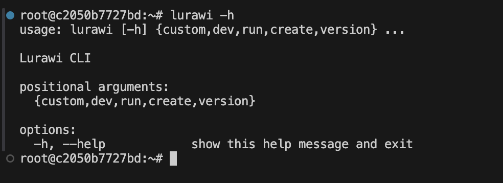

# Lurawi Command Line Interface (CLI)

This document provides an overview of the Lurawi Command Line Interface (CLI) for advanced users, detailing its prerequisites and available commands.

## Prerequisites

Before using the Lurawi CLI, ensure the following:

*   Lurawi is running as a [development Docker container](LurawiDevContainer.md).
*   The environment variables `PROJECT_NAME` and `PROJECT_ACCESS_KEY` are set.

## CLI Commands Overview

To view the available commands, open a terminal in VS Code and execute `lurawi -h`.

<figure>
    
    <figcaption>Figure 1: Lurawi CLI help output in a development container terminal.</figcaption>
</figure>

### Available Commands

| Command                       | Description                                                                                             |
| :---------------------------- | :------------------------------------------------------------------------------------------------------ |
| `lurawi version`              | Displays the current Lurawi version.                                                                    |
| `lurawi run`                  | Starts the Lurawi service.                                                                              |
| `lurawi dev`                  | Initiates the Lurawi development environment, which includes launching the visual editor.                 |
| `lurawi create <project_name>`| Creates a new Lurawi project XML file from a default template. This XML file can be opened in the visual editor. |
| `lurawi custom list`          | Lists all available Lurawi Custom functions.                                                            |
| `lurawi custom new <custom_name>`| Creates a new custom function from a default template. The Python code for this function can then be edited in VS Code. |
 