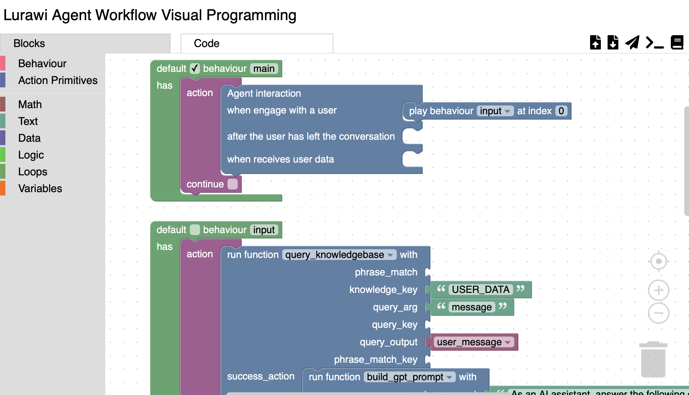
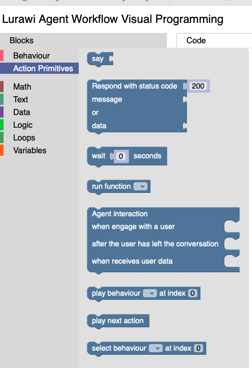
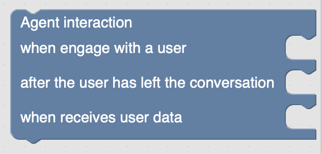
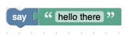
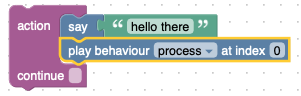
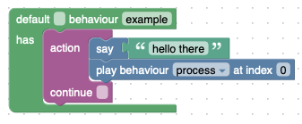
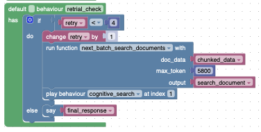
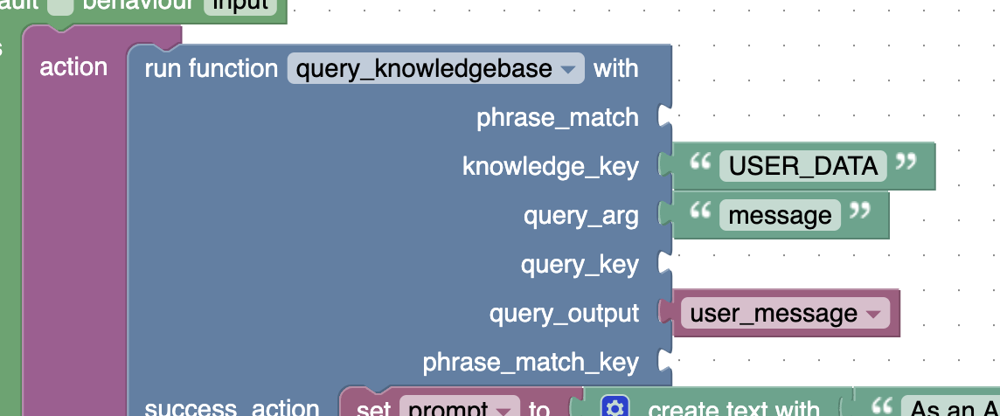

# Lurawi Core Concepts

## Introduction

Lurawi is a powerful workflow construction and orchestration engine designed to enable the creation of complex agent workflows with minimal or no traditional coding. It leverages an intuitive visual programming web interface, drawing inspiration from educational tools like [Scratch](https://scratch.mit.edu/). Familiarity with visual programming paradigms, such as those found in Scratch, is highly recommended for users building workflows with Lurawi.

## Lurawi Visual Programming Editor

The Lurawi visual programming editor provides a graphical interface for designing and managing workflows.


Figure 1: Lurawi Agent Workflow Visual Programming Editor

### Workspace Overview

The visual editor features two primary tabs: **Blocks** and **Code**.

*   **Blocks Tab**: This is the main design area where users drag and drop blocks to compose graphical agent workflows. The left pane categorizes Lurawi-specific blocks into groups such as **Behavior** and **Action Primitives**. Detailed explanations of these blocks are provided in the "Workflow Metaprogramming Language" section.

*   **Code Tab**: This tab displays the real-time JSON translation of the block program constructed in the **Blocks** workspace. This JSON-formatted code is the ultimate representation executed by the Lurawi agent workflow engine.

    **Caution**: While manual modifications to the displayed JSON code are possible, they are not recommended. Changes made directly in the **Code** tab will not be reflected back in the visual Blockly program, leading to a synchronization break between the graphical and code representations. Always treat the Blockly program as the authoritative source for your workflow; the JSON code can be regenerated at any time.

### Workflow File Formats

Lurawi workflows are managed using two distinct file formats:

*   **XML Files**: The graphical Blockly program is saved and loaded in the **Blocks** workspace as an XML file. This format preserves the visual structure of the workflow.
*   **JSON Files**: The corresponding JSON code, generated from the XML, is displayed in the **Code** workspace. This format is the executable representation for Lurawi workflows.

### Programming Workflow

The recommended programming workflow in Lurawi involves the following steps:

1.  **Build in Blocks**: Construct your workflow graphically in the **Blocks** workspace.
2.  **Verify Code**: Frequently switch to the **Code** workspace to verify the generated JSON code. If the block program contains syntactical errors, the JSON will not be successfully generated.
3.  **Save Workflow**: Save your block program (XML file) from the **Blocks** workspace.
4.  **Save JSON**: From the **Code** workspace, save the final JSON code.
5.  **Deployment**: Package the JSON file with the Lurawi runtime engine. (Further details on deployment options are provided in subsequent documentation.)

## Workflow Metaprogramming Language

The Lurawi platform utilizes a specialized metaprogramming language for developing complex workflows. The program file format adheres to the standard JSON format, which can be processed by any JSON reader. The Lurawi meta-language introduces several key concepts, described in the following sections.

### Action Primitives

An **Action Primitive** represents the smallest and simplest action unit that can be performed within Lurawi. It consists of a set of predefined keywords. **Note**: Some Action Primitives do not have direct graphical block representations and are not intended for direct user interaction in block programming. Usable Action Primitive blocks are illustrated in Figure 2 within the visual editor.

<figure>
    
    <figcaption>Fig. 2. Action Primitives in the visual editor.</figcaption>
</figure>

|Name|Descriptions|
|----|------------|
|```text``` | Return a simple (formatted) text message to a client.|
|```delay``` | Specify a time delay in seconds between action units. It should not be used under normal circumstances [1].|
|```knowledge```| Update agent internal knowledge database with key-value pairs as a dict.|
|```workflow_interaction```| Trigger action when a user start conversation with Agent|
|```play_behaviour```| Execute a specified behaviour[1].|
|```select_behaviour```| Select a specified behaviour to be played next.|
|```custom``` | Execute a custom defined plugin Python script module.
|```compare```| Compare two variables and simulate generic if flow control.|
|```calculate```| Simple generic calculation operation|
|```random```| Generate a pseudo random number|
|```comment```| A no-op comment section|

Table 1: A partial list of Action Primitives supported on Lurawi.

#### Custom Action Primitives (Pluggable Python Script Modules)

It is impractical to encapsulate all possible agent-related actions statically within a data file, especially when such actions involve custom data processing or calls to external services. Therefore, Lurawi incorporates custom-defined Python scripts as a key action primitive to handle specialized actions. When a custom action primitive is invoked, the user-defined Python script takes control of the system. Upon completing its designed task, the script returns control to the workflow engine along with the results of its execution.

Lurawi provides a set of predefined custom action primitives that address common use cases. For example, `invoke_llm` is a custom primitive that calls an OpenAI-compatible LLM service. It saves the returned result from the LLM in the knowledge base under the specified `response` key before returning control to the workflow engine. All custom scripts reside in the `custom` subdirectory. Each custom script should include a description and usage example in its docstring. Refer to the current set of customs under the `custom` directory and the [instructions](LurawiGenAiCustoms.md) on how to create a custom action primitive.

The custom **Action Primitive** graphical block in the visual editor dynamically changes its shape when a different custom primitive is selected. Table 2 shows a selection of prebuilt custom primitives in Lurawi:

|Name|Description|
|----|-----------|
| `build_gpt_prompt` | Combines system prompt, user prompt, and retrieved document fragments to form a RAG query prompt. |
| `invoke_llm` | Calls an OpenAI-compatible LLM service to generate text. |

Table 2: A list of prebuilt custom action primitives for Lurawi.

### ActionLet

An **Action Primitive** is not useful by itself; it must be combined with an argument input to form an **ActionLet**. An **ActionLet** is an instantiation of an **Action Primitive**, similar to how an object is an instantiation of a class in object-oriented programming languages like C++.

An **ActionLet** is a two-element list where the first element is the keyword of an **Action Primitive**, and the second element is the argument/input, which can be a string, integer, float, boolean, list, or dictionary JSON data type.

```JSON
["text", "hello there"]
```

The corresponding visual representation in the visual editor:

<figure>
    
    <figcaption>Fig. 3 A say ActionLet.</figcaption>
</figure>

### Action

An **Action** is a list of **ActionLets**. **ActionLets** within an **Action** appear to be executed "simultaneously" [2]. An **Action** is useful when you want to start several action units at the same time, for example, executing a text-sending action along with incrementing a counter variable. An **Action** is not finished until every **ActionLet** inside of the **Action** is completed.

<figure>
    
    <figcaption>Fig. 4 An Action that contains two ActionLets.</figcaption>
</figure>

**Note**: When an **Action** is completed, it does not automatically proceed to the next **Action**. You must append an additional `["play_behavior", "next"]` **ActionLet** within the **Action** to move to the next **Action**. In the visual editor, simply select the *continue* option.

### Behavior

A **Behavior** is the highest-level construct in the action family hierarchy. It is a dictionary with a name and a list of **Actions**. A valid workflow must have all **Actions** enclosed within **Behavior** blocks. Multiple Behaviors can be defined in a single behavior file. Exactly one default behavior, indicated by a ticked `default` checkbox, must be specified in a behavior file. The default behavior is the first behavior that is loaded and executed, equivalent to the `main` function in C/C++.

<figure>
    
    <figcaption>Fig. 5 A valid behaviour block with actions.</figcaption>
</figure>

Furthermore, control flow blocks such as `if`, `while`, etc., must be enclosed directly under a Behavior block, as shown below:

<figure>
    
    <figcaption>Fig. 6 A valid if block under a behaviour block.</figcaption>
</figure>

### Appendix: Notes
[1] `play_behavior` acts as a **goto** statement, executed after all **ActionLets** within the **Action** have completed. It can be used to jump to any specific **Action** defined in a **Behavior**.

[2] ActionLets in an Action are actually executed in sequence. Since all ActionLets are non-blocking (apart from ```delay``` primitive), their executions appear to be simultaneous.

### A Complete Behavior JSON Code Example
```JSON
{
  "default": "__init__",
  "behaviors": [
    {
      "name": "__init__",
      "actions": [
        [
          [ "knowledge", { "COUNTNUM": "", "CNT": "" } ],
          [ "play_behavior", "test1" ]
        ]
      ]
    },
    {
      "name": "test1",
      "actions": [
        [
          [ "workflow_interaction", {
              "engagement": ["play_behavior", "engage:0"]
            }
          ]
        ]
      ]
    },
    {
      "name": "engage",
      "actions": [
        [
          [ "text", "hello there" ],
          [ "play_behavior", "next" ]
        ],
        [
          [ "custom", {
              "name": "number_input",
              "args": {
                "prompt": "ask me to count to a number",
                "output": "COUNTNUM",
                "type": "int",
                "min_value": 1,
                "max_value": 5
              }
            }
          ],
          [ "play_behavior", "next" ]
        ],
        [
          [ "text", [ "I will start to count to {}", ["COUNTNUM"]] ],
          [ "knowledge", { "CNT": 1 } ],
          [ "play_behavior", "next" ]
        ],
        [
          [ "compare", {
              "operand1": "CNT",
              "operand2": "COUNTNUM",
              "comparison_operator": "<=",
              "true_action": [ "play_behavior", "next" ],
              "false_action": [ "play_behavior", "6" ]
            }
          ]
        ],
        [
          [ "text", ["count {}",["CNT"]] ],
          [ "calculate",[ "CNT", "CNT + 1"] ],
          [ "delay", 2 ],
          [ "play_behavior", "next" ]
        ],
        [
          [ "compare", {
              "operand1": "CNT",
              "operand2": "COUNTNUM",
              "comparison_operator": "<=",
              "true_action": [ "play_behavior", "4" ],
              "false_action": [ "play_behavior", "next" ]
            }
          ]
        ],
        [
          [ "text", "done" ],
          [ "play_behavior", "next" ]
        ],
        [
          [ "play_behavior", "engage:1" ]
        ]
      ]
    }
  ]
}
```

## Workflow Knowledge File
Every agent workflow (behavior) file can have an optional knowledge data file. This file stores workflow configuration settings and preloaded data as a JSON dictionary. Keys within this dictionary are always in UPPERCASE and can be directly referenced as variable names within the workflow. For example, when the Lurawi runtime loads the JSON code in `lurawi_example.json`, it will attempt to load `lurawi_example_knowledge.json` if it exists. Behaviors in `lurawi_example.json` can then reference a key in the knowledge dictionary as a predefined variable in its code.


### Lurawi Environment Variables
The following environment variables are defined for every project. While these settings are typically defined in the individual project's knowledge JSON file, they can be overridden by corresponding environment variables:

|Environment variable | Description |
|---|---|
| PROJECT_NAME | Default project name to access Gen.Ai. Hub services |
| PROJECT_ACCESS_KEY | Access key of the project |

### Calling a Workflow in Lurawi

The Lurawi workflow engine exposes a REST endpoint for triggering the loaded workflow:
```
http://{LURAWI_URL}/{project}/message
```

where `project` is the project name. For local testing, include `--skip-auth` in the command line to bypass the authentication step.

The `message` is a JSON payload with the following structure:
```JSON
{
  "uid": "client/user id",
  "name": "client name",
  "session_id": "optional client provided session id",
  "activity_id": "optional activity id provided by previous interaction turn",
  "data" : {
    "message": "a text prompt message"
  }
}
```
`uid` and `name` are unique client user ID and client name, used for triggering tailored workflows for individual users or clients.

`session_id` is an optional client-provided identifier, primarily used for tracing multi-turn conversations when conversation logging is enabled.

`activity_id` represents the last conversation activity returned by the previous workflow call. The client can include `activity_id` to continue the workflow when it is pending additional client input, or use it as a reference to log user feedback from a previous interaction (in which case, a `feedback` string item is expected within the `data` dictionary).

`data` contains a user-defined dictionary that is passed directly to the workflow. The `query_knowledgebase` custom action primitive can be used to extract key-values from this dictionary.

In the case of `lurawi_example` code, we extract `message` as shown below:

Figure 7: Extract message data from input data payload.


### Workflow Response
A `message` call returns a response similar to the following:
```json
{
  "status": "success",
  "session_id": "session id if it is provided by the client",
  "activity_id": "effc95c4-9c8b-4561-b950-d9411d098e80",
  "response": "Hello, I'm an AI assistant"
}
```

