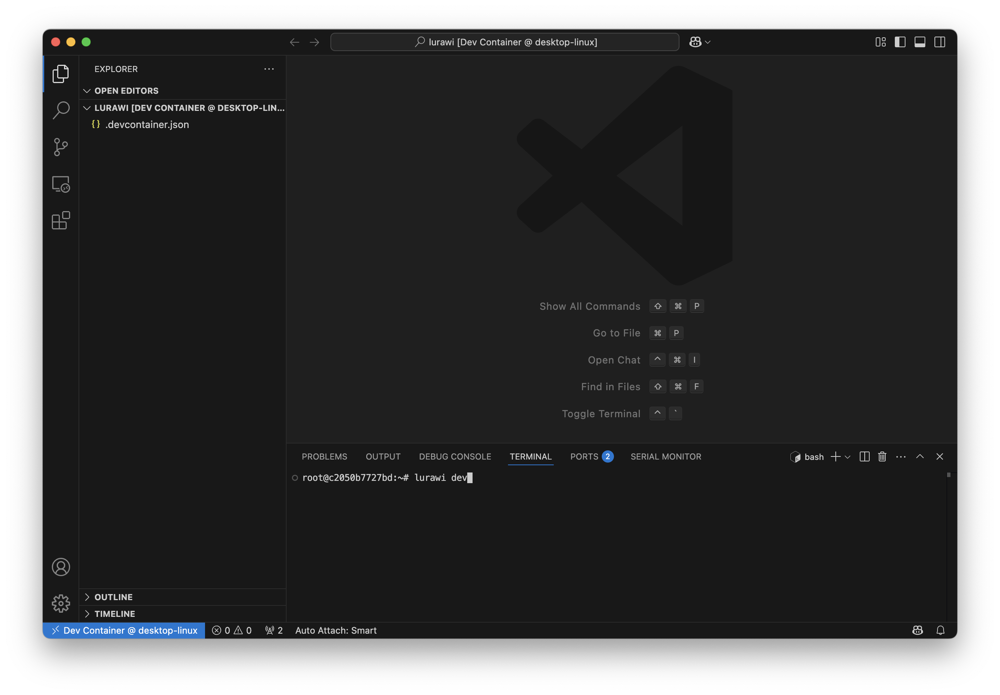

# Advanced Setup: Running Lurawi in a VS Code Dev Container

This document outlines the process for advanced customizations of Lurawi by utilizing the prebuilt Lurawi Docker image within a [Visual Studio Code Dev Container](https://code.visualstudio.com/docs/devcontainers/containers).

*   Visual Studio Code (version 1.5 or newer).
*   The Dev Containers extension for Visual Studio Code.
*   Docker Desktop, installed and running.

## Setup Steps

1.  **Create a Project Directory:** Create a new directory for your project. For example, on macOS, you might create `/Users/{user_name}/lurawi`.
2.  **Configure Dev Container:**
    *   Copy the [`devcontainer.json`](../.devcontainer.json) file from the root of the Lurawi repository into your newly created project directory, naming it `.devcontainer.json`.
    *   Open this new project directory in Visual Studio Code. You will be prompted to "Reopen in Container" (see Fig. 1).

<figure>
    
    <figcaption>Fig. 1 Open Lurawi as a Dev Container.</figcaption>
</figure>

The initial setup involves downloading the Lurawi Docker image and launching it within a running container, which may take some time. Once completed, the entire Lurawi source code working directory will be accessible within the Dev Container (see Fig. 2).

<figure>
    
    <figcaption>Fig. 2 Lurawi in Dev Container.</figcaption>
</figure>

## Initial Configuration and Execution

Within the Dev Container's terminal, set the essential environment variables for your agent project:
```bash
export PROJECT_NAME=project_name
export PROJECT_ACCESS_KEY=project_access_key_provided
```
After setting the variables, execute the following command to start Lurawi:
```bash
lurawi dev
```

You will be prompted to open a local browser window to http://localhost:3031. You can proceed with building a workflow.

## Installing Additional Python Libraries

To install additional Python libraries within the Dev Container, use the following command:

```bash
pip install ${library_name}
```

**Note:** For managing multiple dependencies, it is recommended to list all additional library requirements in a `requirements.txt` file.
