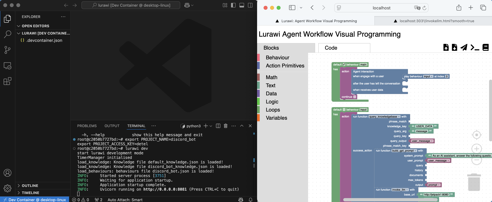

# Advanced: End-to-end Lurawi Development

Before proceeding, ensure you are familiar with the following topics:
* [Advanced: Running Lurawi as a Dev Container in VS Code](LurawiDevContainer.md).
* [Advanced: How to Create Lurawi Custom Action Primitives](LurawiCreateCustom.md).

This document outlines the end-to-end development process for Lurawi, demonstrating how to create an example project (`lurawi_example`) from scratch, build its workflow, and package it into a Docker image for cloud deployment. The instructions assume a macOS local development environment; Windows with WSL should provide a similar experience.

## 1. Create Project

Start a terminal and create a new directory `lurawi_example` under your user home directory. Within `lurawi_example`, create a `.devcontainer.json` file with the following content:

```json
{
  "image": "kunle12/lurawi:latest",
  "customizations": {
    "vscode": {
      "extensions": ["ms-python.python"]
    }
  },
  "forwardPorts": [3031, 8081],
  "mounts": [
      "source=${localWorkspaceFolder},target=/home/lurawi,type=bind,consistency=cached"
  ],
  "workspaceFolder": "/home/lurawi",
  "remoteEnv": {
    "PATH": "${containerEnv:PATH}:/opt/defaultsite/bin",
    "HOME": "/home/lurawi"
  }
}
```

If custom function scripts are required, create a `custom` subdirectory within the project directory.

## 2. Create Dev Container and Run Development Environment

Open the `lurawi_example` folder in Visual Studio Code. When prompted, reopen the folder in the development container. (If the dev container takes an extended period to open, close the window and try again.)

Within the VS Code dev container, open a new terminal. Set the `PROJECT_NAME` and `PROJECT_ACCESS_KEY` environment variables, then execute `lurawi dev`.

Access `localhost:3031` in your browser, as prompted by VS Code. You should observe two windows open on your desktop:

<figure>
    
    <figcaption>Figure 1: Running the Development Environment.</figcaption>
</figure>

Begin constructing your workflow in the visual editor. A pre-configured workflow, `lurawi_example.xml`, is provided for loading into the editor. Ensure you replace the `qwen3` model in the `invoke_llm` ActionLet with an operational LLM model assigned to your project. Dispatch the workflow to the server, then test it by sending the following payload to `http://localhost:8081/lurawi_example/message` using a REST API client:

```json
{
  "uid": "dummyid",
  "name": "dummyname",
  "data" : {
  }
}
```

## 3. Package Workflow in a Docker Container Image

Download the JSON code from the **Code** tab and save it as `lurawi_example.json`. This file must be manually copied from your download directory to your project directory.

Create a `Dockerfile` with the following content:

```Docker
FROM kunle12/lurawi:latest
# Update the following line with your project name
ENV PROJECT_NAME lurawi_example
COPY lurawi_example.json /opt/defaultsite
# If you have a knowledge file, uncomment the next line:
# COPY lurawi_example_knowledge.json /opt/defaultsite
# If you create additional custom function scripts for your project, uncomment the next line:
# COPY custom /opt/defaultsite/lurawi/custom
# Remove "--skip-auth" and "--no-ssl-verify" for production deployment.
ENTRYPOINT ["python", "app.py", "--skip-auth", "--no-ssl-verify" ]
```

Build the Docker image using the following command:

```bash
docker build . -t lurawi_example:latest
```

## 4. (Optional) Create New Custom Function
The existing workflow calls `query_knowledgebase` multiple times to extract values for different keys from a dictionary (defined by `knowledge_key`). Consider creating a new custom function to consolidate these operations into a single step. This is presented as a challenge to design an appropriate function input interface that can be graphically represented as a block.

### Notes on Custom Function Script Creation
For development and testing, all custom functions must reside in the `lurawi/custom` directory within the dev container. To create a new custom function, execute `lurawi custom new function_name` and then modify the generated file. Remember to uncomment line 12 in your `Dockerfile` to include custom functions in your Docker image.

### Final Project Structure

Upon completion, your project directory should have the following structure:

```
lurawi_example
├── custom                      # Project-specific custom function scripts
├── lurawi_example.xml          # Block workflow code in XML format
├── lurawi_example.json         # JSON workflow code
├── lurawi_example_knowledge.json # Associated JSON knowledge dictionary
├── .devcontainer.json          # Development container configuration
├── Dockerfile                  # Dockerfile for building the final Docker image
└── README.md                   # Project README file
 ```

A codebase skeleton for this example is available at [lurawi_example_skeleton.zip](./lurawi_example_skeleton.zip).
