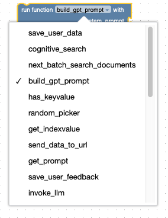
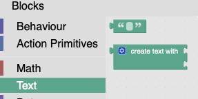
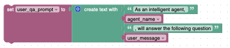
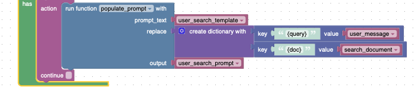
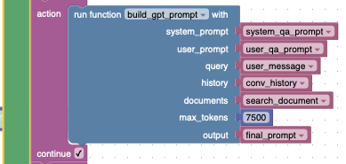
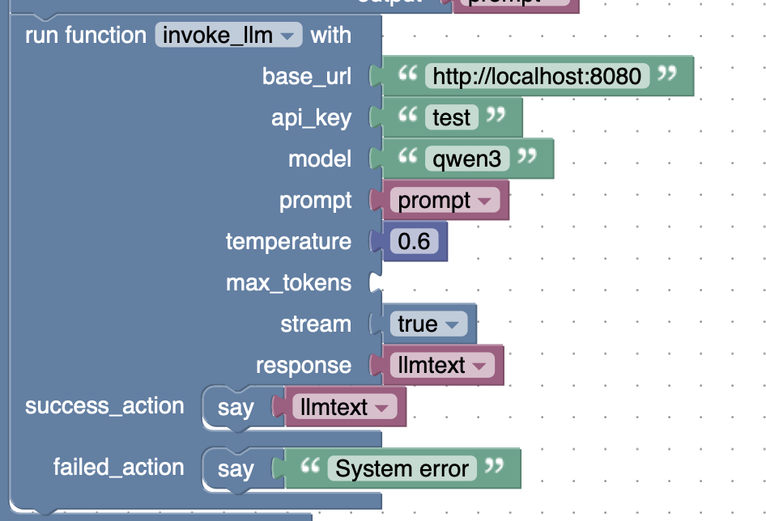

# Lurawi Custom Function Blocks

## Introduction
Lurawi has an extensible plug-in system that built upon custom Python script modules/functions. These modules are represented in the visual editor as ```run_function``` block, i.e. custom function block. Click on the pulldown list will reveal all custom functions currently available in the system:

<figure>
    
    <figcaption>Fig. 1 Available custom functions.</figcaption>
</figure>

Selecting one of the custom functions will change the shape of the custom function block (for example Fig. 1). One can attach data blocks to the entry points of the custom function block. This document will provide details on the custom functions that can be used to build Agent based workflow leveraging the capabilities provided by Gen. Ai. Hub foundation service. The following sections are organised based on the tasks you want to achieve. NOTE: see [Advanced: RAG Reference Implementation in Lurawi](RAGReferenceImplementation.md) how these custom function blocks are being used.

## Prompt Constructions

### Manual Prompt Construction

Using the standard **Text** blocks to build a prompt string piece by piece:


Select ```create text with``` block and plug in plain text or variable blocks and form a complete text prompt. The result text can be either put into another variable (in an **ActionLet**), or attach to a custom function block. For example:
<br>  
<figure>
    
    <figcaption>Fig. 2: Compose a prompt text string and save into a variable as an ActionLet.</figcaption>
</figure>

### Populate a Prompt Template

You can populate a templated prompt string (stored in a variable) using ```populate_prompt``` custom function: 



```prompt_text``` takes in a prompt template string; ```replace``` takes in a dictionary similar to ```replace``` in ```get_prompt``` custom. The final text string goes to the variable attached to ```output```.


### Build OpenAI GPT Specific Prompt

````build_gpt_prompt```` is a convenient custom function that combine system prompt, user prompt, (optional) search document and (optional) conversation history into a OpenAI GPT prompt list structure:
```json
[
  {"role": "system", "content": "system prompt"},
  {"role": "user", "content": "user prompt text"},
  ...
]
```



You can specify ```max_tokens``` to restrict the overall size of final output prompt. If the constructed prompt exceeds the maximum size. history and document data will be stripped out step-by-step to reduce the final prompt size.
<br>
<br>
<br>
<br>

## Calling OpenAI Compatible LLM endpoint

Usage of ```invoke_llm``` is very similar (and self-explanatory) to ```get_prompt``` custom function:



Note that ```stream``` takes a boolean value. When it is set to true and invoke Agent is successful, a ```stream_point``` is sent to the client in a payload response as the final result. The workflow terminates at this point (```success_action``` won't be called) The client must use the string to fetch the stream itself.

```stream``` is default to false. In this case, result of calling llm will be saved in ```response``` and can be returned to client via ```say``` action.
